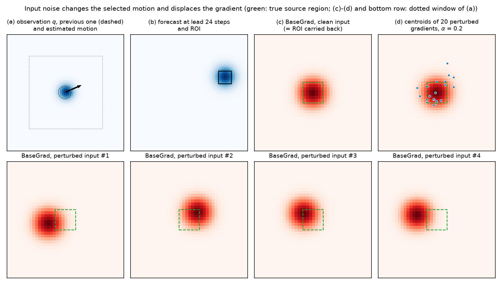
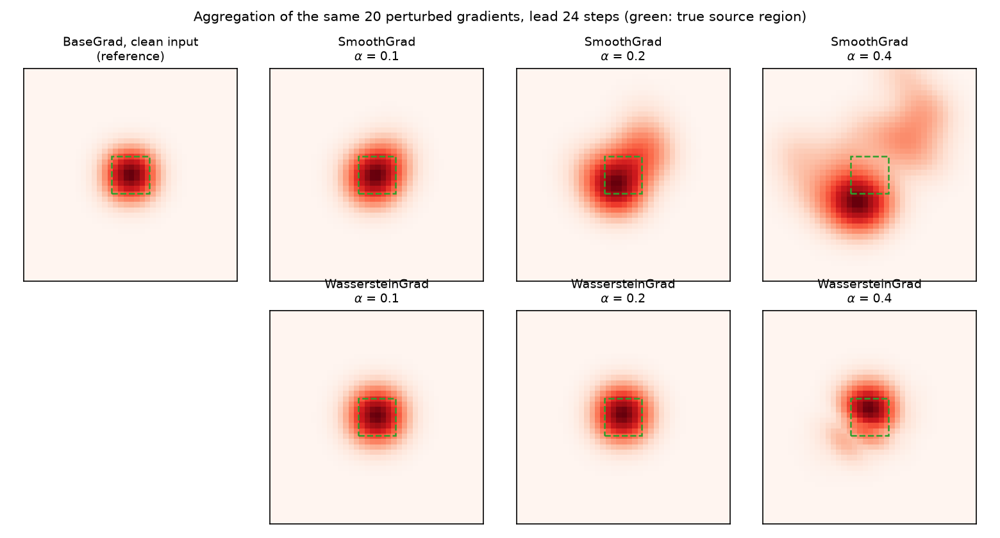
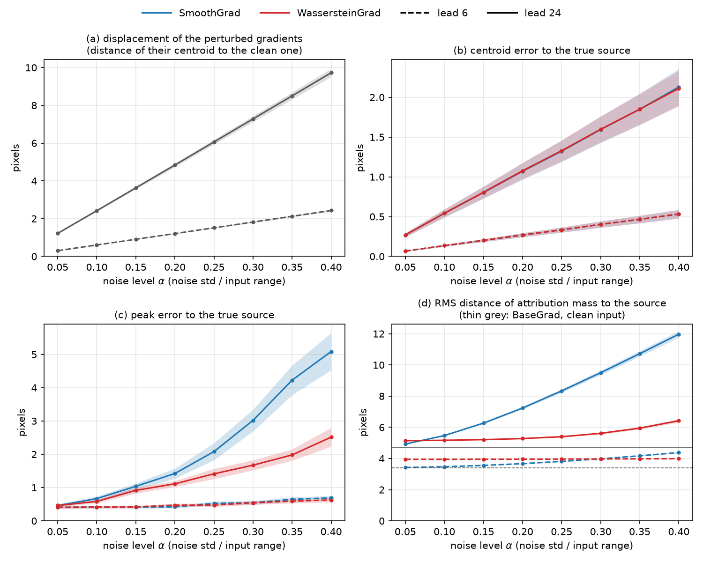

# WassersteinGrad: toy experiment

Reproducible companion to *Explanation of Dynamic Physical Field Predictions using
WassersteinGrad: Application to Autoregressive Weather Forecasting*
([arXiv:2604.22580](https://arxiv.org/abs/2604.22580)). This branch reproduces, in a small
controlled model, the phenomenon the paper builds on. It needs only PyTorch and POT and runs
on a CPU in about two minutes. The weather forecasting code is on the
[`py4cast`](https://github.com/younesessafouri/py4cast-xai/tree/py4cast) branch.

## The phenomenon

Forecasting models route information in space: max pooling and attention select where
features come from, and so does the motion estimation of a nowcast. The input gradient of a
forecast over a region of interest (ROI) is then the ROI carried back along the selected
motion: the region the forecast comes from. SmoothGrad-type methods add noise to the input.
The noise changes the selected motion, so the whole gradient map moves. The perturbed
gradients are displaced copies of the clean gradient, not noisy versions of it.

**Why pointwise averaging blurs.** If $G_i(x) = G(x - d_i)$, SmoothGrad returns
$\frac1N \sum_i G(x - d_i)$: the clean map convolved with the cloud of displacements
$d_i$. Its size grows with the noise level and the lead time, so the structure spreads out,
and its maximum follows whichever displaced copies overlap.

**What WassersteinGrad changes.** WassersteinGrad maps each $|G_i|$ to a probability measure
and takes the Wasserstein barycenter of these measures. For translated copies of one measure,
the 2-Wasserstein barycenter is that measure translated by the mean displacement: positions
are averaged and the shape is kept. The barycenter is entropic, with λ = 1e-3 as in the paper.
On this 64 × 64 grid, that is a Gaussian kernel of about 1.4 pixels, which adds a small,
fixed blur.

## Model

An extrapolation nowcast (`synthetic/advection.py`) on a 64 × 64 periodic grid:

1. **Input.** The observation $q$ contains a Gaussian storm cell. The observation one step
   earlier is fixed context.
2. **Motion estimation.** Block matching gives the velocity $m$ as the shift that maximises the
   cross-correlation of the two observations, searched on a 0.01-pixel grid. This argmax is
   the routing step. It is piecewise constant, like max pooling, so gradients flow only
   through step 3.
3. **Propagator.** $q$ is advected by $m$ and diffused for `lead` steps,
   $\partial_t q + m\cdot\nabla q = \nu\Delta q$ with $\nu$ = 0.15 px²/step (≈ 500 m²/s at
   1 km and 5 min). It is solved exactly in Fourier space.
4. **Target.** The mean of the forecast over a 7 × 7 pixel ROI centred on where the cell
   arrives.

**Ground truth.** The input gradient is the ROI carried back by $-m$ × lead and diffused.
The true source region (green box in the figures) is therefore known exactly.

**Protocol.** Following Algorithm 1 of the paper:
- noise of std α × (max − min) is added to the explained input $q$ only;
- N = 20 samples, λ = 1e-3;
- SmoothGrad and WassersteinGrad aggregate the same perturbed gradients.

Metrics are averaged over 24 random cells (speed 0.5–1 px/step, any direction, radius
2.5–4 px) at lead times of 6 and 24 steps.

## Reproduce

```bash
pip install -r requirements.txt
python -m synthetic.sanity_checks   # physics and gradient checks, a few seconds
python -m synthetic.run_advection   # figures and metrics.json in results/, about 1.5 min
```

Everything runs in float64 with fixed seeds, and two runs on the same machine give
byte-identical outputs. With a different number of CPU threads, summation order changes:
- gradients and SmoothGrad metrics agree to about 1e-15;
- WassersteinGrad metrics agree to about 1e-6 px (Sinkhorn iterations).
`sanity_checks` compares the forecast with the analytic solution (advected and diffused
Gaussian) and checks:
- mass conservation;
- recovery of the true velocity;
- the gradient against the adjoint solution and against finite differences;
- that each perturbed gradient is the clean one moved by exactly lead × (motion error).

## Results



**Input noise displaces the attribution.** At the clean input, BaseGrad is exactly the
source region (c). At α = 0.2, each perturbed input selects a slightly different motion. Its
gradient is the same structure, moved by several pixels (bottom row), and the centroids of the
20 perturbed gradients scatter around the source (d).



**Pointwise averaging blurs; the barycenter keeps the structure.** SmoothGrad smears the
displaced copies into a broad, lopsided map with ghost lobes as noise grows. From the same
20 gradients, WassersteinGrad returns a compact map of the size of the true source.



**Quantitatively** (mean ± SEM over 24 cells):
- **(a)** The displacement of the perturbed gradients grows linearly with the noise level. It
  is four times larger at lead 24 than at lead 6, since the motion error is extrapolated over
  the lead time. This mirrors the paper's growth of displacement from t+1 to t+5.
- **(b)** Both methods average positions, so their centroids are equally close to the source.
- **(c, d)** They differ in shape. SmoothGrad's peak drifts away from the source and its mass
  spreads with the displacement. WassersteinGrad stays close to the clean map.

| Lead 24 steps                                   | α = 0.1     | α = 0.2     | α = 0.4      |
|-------------------------------------------------|-------------|-------------|--------------|
| Displacement of perturbed gradients (px)        | 2.4         | 4.8         | 9.7          |
| Peak error, SmoothGrad / WassersteinGrad (px)   | 0.67 / 0.58 | 1.42 / 1.11 | 5.08 / 2.51  |
| RMS distance to source, SG / WG (clean: 4.73 px)| 5.47 / 5.17 | 7.24 / 5.28 | 11.97 / 6.42 |
| Gini sparsity, SG / WG (clean: 0.97)            | 0.95 / 0.96 | 0.93 / 0.96 | 0.83 / 0.95  |

The entropic blur has a cost. Below about 1.5 px of displacement, about the width of the
kernel, SmoothGrad is slightly more compact than WassersteinGrad. This covers lead 6 with
α ≤ 0.25 (dashed lines in (d)) and lead 24 with α = 0.05. WassersteinGrad pays off once the
displacement exceeds this blur.

## Scope

- **BaseGrad is a reference, not a competitor.** This model has no gradient shattering, so
  BaseGrad at the clean input is exact and serves as ground truth. The comparison is between
  two ways of aggregating the same perturbed gradients.
- **The displacement comes from the routing step.** With the motion fixed, the model is
  linear and input noise leaves the gradient unchanged (checked in `sanity_checks`). We also
  tried a differentiable (sub-pixel fit) motion estimator and a vortex advected by its own
  flow. In both, input noise mostly added other gradient terms rather than a clean
  displacement: a dipole at the source, or broad zero-mean patterns. The toy isolates the
  displacement mechanism.
- **Translations only.** Here the perturbed gradients are exact translations. In the weather
  model, they are also deformed.

## Files

```
synthetic/
  methods.py         BaseGrad, SmoothGrad, WassersteinGrad for any differentiable f: (B, H, W) -> (B,)
  advection.py       the nowcast model: motion estimation, advection-diffusion propagator, ROI target
  metrics.py         centroid, peak and RMS distance to a point, Gini index (periodic grid)
  plots.py           the three figures
  run_advection.py   experiment: python -m synthetic.run_advection
  sanity_checks.py   physics and gradient checks: python -m synthetic.sanity_checks
results/             figures and metrics.json produced by run_advection
```

The three methods take the model `f` and one input field `x` of shape (H, W):

```python
from synthetic.methods import base_grad, smooth_grad, wasserstein_grad

g_base = base_grad(f, x)
g_sg = smooth_grad(f, x, noise_level=0.2, n_samples=20)
g_wg = wasserstein_grad(f, x, noise_level=0.2, n_samples=20, reg=1e-3)  # WGBary
g_wg_x_grad = g_wg * g_base                                               # WGBary×Grad
```

## Citation

```bibtex
@article{essafouri2026wassersteingrad,
  title   = {Explanation of Dynamic Physical Field Predictions using {WassersteinGrad}:
             Application to Autoregressive Weather Forecasting},
  author  = {Essafouri, Younes and Raynaud, Laure and Drozda, Luciano and Risser, Laurent},
  journal = {arXiv preprint arXiv:2604.22580},
  year    = {2026}
}
```
